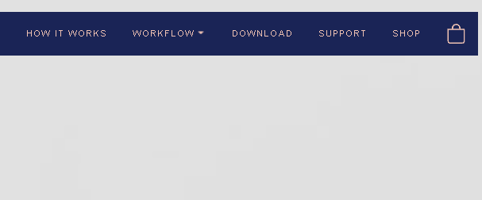

# Monogram-copy
Copy of the https://monogramcc.com/shop/

<h3>FUNCTIONS</h3>

```sh
> Sticky Navbar
> Hover Effects
> Same colors pallete, fonts and images 
> HTML, CSS, JS and css variables
```

<div style="float:right">
  
## Original Website


## Copy Website
  
- [x] Hover images
- [x] Dropdown Menu
  

  

</div>
  
```sh
>To test, click in Code > Zip > Download and Execute index.html<
```
